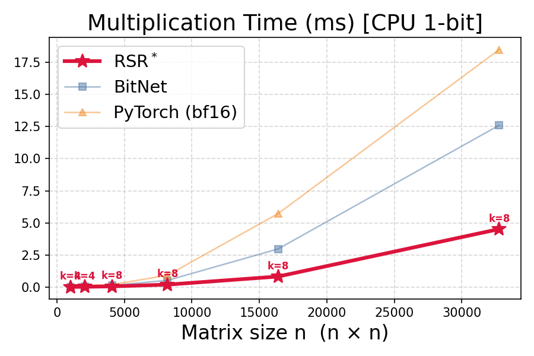
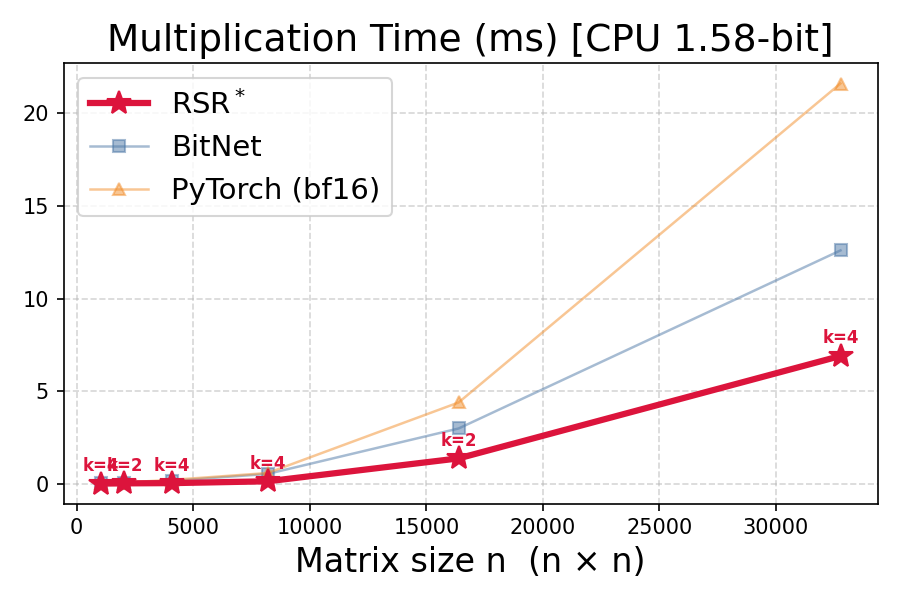
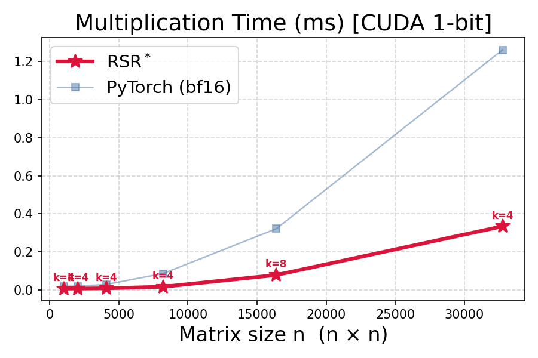
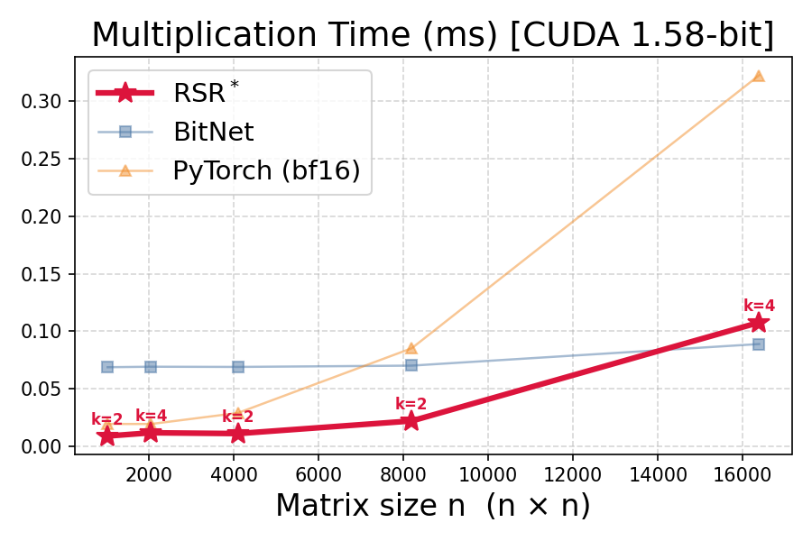

# RSR-core

**RSR (Redundant Segment Reduction)** for efficient low-bit inference (matrix-vector multiplication).

This repository contains the core kernels, model integrations, and benchmarking code for **RSR** across CPU and CUDA backends. RSR targets fast matrix-vector multiplication when the matrix is low-bit quantized by grouping repeated column patterns, aggregating the corresponding input values once, and then scattering the result to the affected output rows. 

This is especially useful for workloads such as low-bit LLM inference, where decoding repeatedly applies quantized matvec operations. For the original algorithm, see [UIC-InDeXLab/RSR](https://github.com/UIC-InDeXLab/RSR).

### Docs 📄
- [docs/ALGORITHM.md](docs/ALGORITHM.md) — The RSR algorithm explained
- [docs/OPTIMIZATION.md](docs/OPTIMIZATION.md) — Kernel optimization breakdown for all multiplier versions

### Table of Contents
- [Demo](#demo-)
- [Usage](#usage-%EF%B8%8F)
- [Benchmark Results](#benchmark-results-)
- [Updates](#updates-)
- [Project Structure](#project-structure-%EF%B8%8F)
- [Citation](#citation-)

## Demo 🎬
Inference on CPU for a 1.58-bit LLM decoding step. Click the image to view the original high-quality video. `HF` denotes the Hugging Face baseline running `bfloat16` on PyTorch.

`PROMPT: "Write the numbers from one to sixty in words separated by commas only:"`

[](https://drive.google.com/file/d/1ub-MITJUepmfBLkyUZFb50hbJsuhgwCH/view?usp=sharing)

## Usage 🛠️
### Installation 📦
**Prerequisites:** Python >= 3.10, a C compiler for CPU kernels, and optionally CUDA for GPU support.

```bash
git clone https://github.com/UIC-InDeXLab/RSR-Core.git
cd RSR-Core
pip install -e . --no-build-isolation
```

#### Building the kernels

Both CPU and CUDA kernels are automatically built during `pip install -e . --no-build-isolation`.
You can also build them manually:

**CPU kernels** — Compile the C shared libraries via the provided Makefiles.
Requires `gcc` with AVX2 and OpenMP support.

```bash
make -C kernels/bit_1/cpu
make -C kernels/bit_1_58/cpu
```

**CUDA kernels** — Pre-built during install if a GPU is available. If not,
they are JIT-compiled by PyTorch on first use (`torch.utils.cpp_extension`).
Requirements:
- CUDA toolkit (matching your PyTorch build)
- `ninja` (`pip install ninja`)

To rebuild CPU kernels from scratch, run `make clean` first:

```bash
make -C kernels/bit_1/cpu clean && make -C kernels/bit_1/cpu
make -C kernels/bit_1_58/cpu clean && make -C kernels/bit_1_58/cpu
```

*Run tests with `pytest`.*

### Prepare a model (once) 🧱
Run `integrations/hf/model_prep.py` once per model to preprocess the ternary
weights and save the RSR metadata needed for inference.

```bash
python -m integrations.hf.model_prep \
  --model microsoft/bitnet-b1.58-2B-4T \
  --output ./preprocessed_model \
  --device cpu \
  --trust-remote-code \
  --best-k-json benchmarking/bit_1_58/reports/best_k_cpu.json
```

```text
CLI args for integrations/hf/model_prep.py:
  --model, -m           HuggingFace model ID or local path (required)
  --output, -o          Output directory for the preprocessed model (required)
  --k                   Block height for RSR decomposition (default: from best_k_{device}.json)
  --version             RSR multiplier version to use (default: adaptive)
  --device              Device for model loading: cpu or cuda (default: cpu)
  --trust-remote-code   Allow remote code when loading HuggingFace models
  --best-k-json         Optional path to a per-layer best-k JSON file
                        Default:
                        benchmarking/bit_1_58/reports/best_k_{device}.json
```

> [!NOTE]
> `k` might be hardware-dependent, so run the `best_k` benchmark on the same machine
> and device you plan to use for inference, then reuse the generated JSON.

### Run model inference 🤖
Use `integrations/hf/model_infer.py` to run generation from a preprocessed
model directory. The default backend is `rsr`.

```bash
python -m integrations.hf.model_infer \
  --model-dir ./preprocessed_model \
  --backend rsr \
  --device cpu \
  --prompt "Write the numbers from one to ten in words." \
  --max-new-tokens 64 \
  --stream
```

```text
CLI args for integrations/hf/model_infer.py:
  --model-dir          Directory with rsr_config.json and safetensors artifacts
                       (default: integrations/hf)
  --backend            Inference backend: rsr or hf (default: rsr)
  --tokenizer          Optional tokenizer source
                       Default: rsr_config.json:model_name
  --device             Target device; auto-detected from model-dir suffix
                       (_cpu / _cuda) if omitted
  --dtype              Optional dtype cast: float32, float16, or bfloat16
  --prompt             Prompt text to generate from (required)
  --max-new-tokens     Maximum number of tokens to generate (default: 64)
  --no-chat-template   Tokenize the raw prompt directly
  --stream             Stream decoded output as tokens are generated
```

#### Benchmark on your machine ⏱️
Use the scripts under `benchmarking/` to reproduce the local numbers for
kernel-level matvec benchmarks and end-to-end LLM inference.

**Find the best `k` for ternary RSR**

```bash
python -m benchmarking.bit_1_58.bench_best_k \
  --device cpu \
  --shapes 2560x2560 4096x14336 \
  --k-values 2 4 6 8 10 12 \
  --warmup 10 \
  --repeats 30
```

```text
CLI args for benchmarking/bit_1_58/bench_best_k.py:
  --device             Target device: cpu or cuda (required)
  --shapes             Optional list of matrix shapes in NxM format
                       Default: all known preprocessed model shapes
  --k-values           Optional list of k values to test
                       Default: 2 4 6 8 10 12
  --warmup             Warmup iterations before timing (default: 10)
  --repeats            Timed iterations per shape/k (default: 30)
```

This writes:
`benchmarking/bit_1_58/reports/best_k_{device}.csv` and
`benchmarking/bit_1_58/reports/best_k_{device}.json`

**Benchmark matrix-vector multiplication**

The shape benchmark scripts do not take CLI arguments. Configure them by
editing the constants at the top of the script:
`SHAPES`, `K_VALUES`, `METHODS`, `REPEATS`, and `WARMUP`.

```bash
python benchmarking/bit_1/bench_shapes_cpu.py
python benchmarking/bit_1/bench_shapes_cuda.py
python benchmarking/bit_1_58/bench_shapes_cpu.py
python benchmarking/bit_1_58/bench_shapes_cuda.py
```

Reports are written to:
`benchmarking/bit_1/reports/results_shapes_{device}.csv`
`benchmarking/bit_1_58/reports/results_shapes_{device}.csv`

**Benchmark end-to-end LLM inference**

Pass either a single preprocessed model directory or a parent directory that
contains multiple `*_cpu` or `*_cuda` model directories.

```bash
python -m benchmarking.llms.bench_inference \
  --model-dir integrations/hf/preprocessed \
  --device cpu \
  --prompt "Write the numbers from one to two hundred in words separated by commas only:" \
  --max-new-tokens 64 \
  --warmup 1 \
  --repeats 3 \
  --backends rsr hf_float32 hf_bfloat16
```

```text
CLI args for benchmarking/llms/bench_inference.py:
  --model-dir          Single preprocessed model directory or parent directory
                       containing multiple preprocessed models (required)
  --prompt             Prompt text to generate from
                       Default: "Write the numbers from one to two hundred in
                       words separated by commas only:"
  --max-new-tokens     Maximum number of generated tokens (default: 64)
  --warmup             Warmup generations before timing (default: 1)
  --repeats            Timed generations per backend/model (default: 3)
  --no-chat-template   Tokenize the raw prompt directly
  --device             Target device and model suffix filter: cpu or cuda
                       (required)
  --backends           Optional backend list:
                       rsr, hf_float32, hf_bfloat16, hf_float16
                       Default: rsr + the standard HF dtypes for the device
```

### UI 🖥️
A web-based dashboard for managing the full RSR workflow: browse and
preprocess models, run inference, compare backends, and view benchmark
results — all from the browser.

**Prerequisites:** Node.js (for the Vite frontend) and the backend Python
packages:

```bash
pip install fastapi "uvicorn[standard]" huggingface_hub
cd ui/frontend && npm install && cd ../..
```

```bash
./ui/start.sh
```

This launches the FastAPI backend on `http://localhost:8042` and the Vite
frontend on `http://localhost:5173`. Press `Ctrl+C` to stop both.

**What you can do:**

- **Models** — List preprocessed models, search HuggingFace Hub for ternary
  models, inspect configs, and delete models.
- **Preprocess** — Convert a HuggingFace model to RSR format with
  configurable `k`, version, and device, with background progress tracking.
- **Inference** — Generate text from a preprocessed model and compare RSR
  vs HuggingFace backends side-by-side with performance metrics (tok/s, load
  time).
- **Benchmarks** — Browse existing reports, view plots, and launch custom
  inference benchmarks.
- **Multipliers** — Discover available kernel implementations for each
  bit-width and platform.

## Benchmark Results 📊

> [!NOTE]
> The results below were measured on a machine with Python 3.12.7, PyTorch
> 2.10.0+cu128, an NVIDIA GeForce RTX 5090, and a 64-logical-thread CPU.

### Matrix-Vector Multiplication 🧮

#### CPU 🖥️

| 1-bit | 1.58-bit |
|:---:|:---:|
|  |  |

#### CUDA ⚡

| 1-bit | 1.58-bit |
|:---:|:---:|
|  |  |

### Ternary (1.58bit) LLMs 🤖

Speedup is computed against the HuggingFace `bfloat16` baseline for the same model.

#### CPU 🖥️

| Model | HF Tok/s | RSR Tok/s | Speedup |
| :--- | ---: | ---: | ---: |
| Falcon3-10B-Instruct-1.58bit | 0.2 | **11.3** | **62.0x** |
| Llama3-8B-1.58-100B-tokens | 0.2 | **13.4** | **53.8x** |
| bitnet-b1.58-2B-4T-bf16 | 2.1 | **28.8** | **13.9x** |
| bitnet-b1.58-2B-4T | 14.2 | **29.3** | **2.1x** |

#### CUDA ⚡

| Model | HF Tok/s | RSR Tok/s | Speedup |
| :--- | ---: | ---: | ---: |
| Falcon3-10B-Instruct-1.58bit | 25.2 | **47.4** | **1.9x** |
| Llama3-8B-1.58-100B-tokens | 31.9 | **59.3** | **1.9x** |
| bitnet-b1.58-2B-4T-bf16 | 33.1 | **57.4** | **1.7x** |
| bitnet-b1.58-2B-4T | 41.6 | **57.1** | **1.4x** |

## Updates 📝
* [03/25/2026] Support HuggingFace models interface.
* [03/27/2026] A simple UI added for managing main workflow.
* [Coming soon...] Support `BitNet` model inference.

## Project Structure 🗂️

```text
RSR-core/
├── multiplier/             # Python wrappers for kernels
│   ├── bit_1/              # 1-bit (binary) multipliers (CPU/CUDA)
│   └── bit_1_58/           # 1.58-bit (ternary) multipliers (CPU/CUDA)
├── kernels/                # Low-level C/CUDA kernel source
│   ├── bit_1/
│   │   ├── cpu/            #   C kernels
│   │   └── cuda/           #   CUDA kernels (.cu)
│   └── bit_1_58/
│       ├── cpu/            #   C kernels
│       └── cuda/           #   CUDA kernels (.cu)
├── integrations/           # Model integrations
│   └── hf/                 #   HuggingFace integration
├── benchmarking/           # Benchmarking scripts & results
├── ui/                     # Web UI (FastAPI + Vite/React)
│   ├── backend/            #   REST API server
│   └── frontend/           #   React dashboard
└── tests/                  # Unit and integration tests
```

## Citation 📝

If you use this repository in your research or project, please cite our work:

```bibtex
@inproceedings{dehghankarefficient,
  title={An Efficient Matrix Multiplication Algorithm for Accelerating Inference in Binary and Ternary Neural Networks},
  author={Dehghankar, Mohsen and Erfanian, Mahdi and Asudeh, Abolfazl},
  booktitle={Forty-second International Conference on Machine Learning},
  year={2025}
}
```
